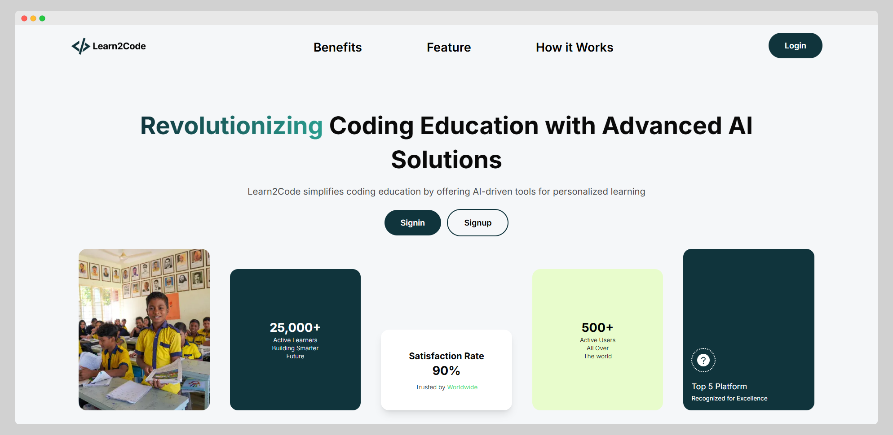

# Learn2Code

Learn2Code aims to make learning coding more enjoyable and streamlined by utilizing cutting-edge AI technology. Instead of jumping between several platforms, a learner can use Learn2Code to track all their coding progress, saving time and energy. It also helps users organize their learning and assess their skills.


## 🚀 Features

### Programming Resource Hub + AI-powered Code Editor

The resource hub contains various video tutorials for programming languages as well as other technologies related to them. For example, if anyone wants to learn JavaScript, they can visit the resource hub and find related videos, courses, and other resources.

Additionally, there is a built-in code editor with each video resource. This is so that the learner doesn’t have to go back and forth between the video and their editor. He can write the code in that editor while watching the video, select a language, and run it from the same browser window.

The code editor will have an integrated AI coding assistant. Upon pressing ‘Review’, the AI assistant will review the code, evaluate it, and suggest changes to make it more optimized.

### Roadmap Generator

Suppose a person wants to become a front-end developer. However, he doesn’t have any idea what to learn or even where to begin. He gives a prompt to the AI-powered Roadmap Generator and asks it to create a roadmap for him.

The Roadmap Generator will generate a personalized, comprehensive roadmap considering the user’s time commitment, topic interest, and final goals.

The roadmap will contain topics to learn, an explanation of each topic, code examples, linked resources to YouTube videos, books, blogs, and official documentation.

### Quizzes

In order to solidify the learner’s knowledge and practice what he has learned, a user can give quizzes based on the learning material he has consumed. For example, someone watched a video on JavaScript asynchronous programming. After watching the video, he will find an option to take a quiz on that topic. An AI assistant will analyze the video and create some quiz questions for the user, and then give the solution after submitting the answer script.

### Upload Study Materials

The app allows the user to upload their own study material, such as PDFs, books, slides, etc. After uploading a file, the AI will analyze the file and keep the content in its memory. After that, the user can ask any questions about that material to the AI for further learning, and it will answer in the correct context.

The user can either select text from the PDF or take a screenshot and provide it to the AI assistant for analysis. This provides more flexibility to the user and allows analyzing non-text material such as images, diagrams, etc.

In addition to that, the user can also ask the AI to generate quizzes from the study material, answer them, and check the correct solutions afterward.

### AI Chatbot

Learn2Code has an AI Chatbot that will answer all your questions about the app. Stuck somewhere? Ask the AI to guide you. Don’t know how to use a feature? The chatbot will teach you. Can’t find a feature? The chatbot will help you find it.

### Resume Analysis + Mock Interview

Learn2Code doesn’t just stop at helping you learn how to code. It also helps you land your dream tech job. You can upload your resume to the app. An AI will analyze your resume to understand your current knowledge, skills, and capabilities.

The app also has a mock interview system. After uploading your resume, you can select what type of role you’re looking for. After that, you’ll be taken to a new window where you can.

## 📁 Project Structure

```
Learn2Code/
├── .DS_Store
├── .gitignore
├── client/
│   ├── .eslintrc.json
│   ├── .gitignore
│   ├── components.json
│   ├── next.config.mjs
│   ├── package-lock.json
│   ├── package.json
│   ├── postcss.config.mjs
│   ├── public/
│   │   ├── images/
│   │   │   ├── checkmark.png
│   │   │   ├── logo2.png
│   │   │   ├── signin.png
│   │   │   ├── signup.png
│   │   │   ├── student.jpg
│   │   │   └── vector.png
│   │   ├── next.svg
│   │   └── vercel.svg
│   ├── README.md
│   ├── src/
│   │   ├── app/
│   │   │   ├── _home/
│   │   │   │   ├── Benefits.tsx
│   │   │   │   ├── Contact.tsx
│   │   │   │   ├── Feature.tsx
│   │   │   │   └── Hero.tsx
│   │   │   ├── (user)/
│   │   │   │   ├── layout.tsx
│   │   │   │   └── userdashboard/
│   │   │   │       ├── interview/
│   │   │   │       │   ├── [id]/
│   │   │   │       │   │   └── page.tsx
│   │   │   │       │   └── page.tsx
│   │   │   │       ├── overview/
│   │   │   │       │   └── page.tsx
│   │   │   │       ├── planner/
│   │   │   │       │   ├── [slug]/
│   │   │   │       │   │   └── page.tsx
│   │   │   │       │   └── page.tsx
│   │   │   │       ├── quiz/
│   │   │   │       │   ├── _datatable/
│   │   │   │       │   │   ├── action.tsx
│   │   │   │       │   │   └── data.tsx
│   │   │   │       │   ├── [title]/
│   │   │   │       │   │   └── page.tsx
│   │   │   │       │   ├── page.tsx
│   │   │   │       │   ├── result/
│   │   │   │       │   │   └── page.tsx
│   │   │   │       │   └── take/
│   │   │   │       │       └── page.tsx
│   │   │   │       ├── study/
│   │   │   │       │   ├── _video/
│   │   │   │       │   │   ├── CodeEditor.tsx
│   │   │   │       │   │   ├── LanguageSelector.tsx
│   │   │   │       │   │   ├── Output.tsx
│   │   │   │       │   │   ├── Review.tsx
│   │   │   │       │   │   ├── skeleton.jsx
│   │   │   │       │   │   └── VideoCard.tsx
│   │   │   │       │   ├── page.tsx
│   │   │   │       │   └── watch/
│   │   │   │       │       └── page.tsx
│   │   │   │       └── upload/
│   │   │   │           ├── _datatable/
│   │   │   │           │   ├── action.tsx
│   │   │   │           │   └── data.tsx
│   │   │   │           ├── page.tsx
│   │   │   │           └── read/
│   │   │   │               └── page.tsx
│   │   │   ├── favicon.ico
│   │   │   ├── globals.css
│   │   │   ├── interview/
│   │   │   │   ├── page.tsx
│   │   │   │   └── result/
│   │   │   │       └── page.tsx
│   │   │   ├── layout.tsx
│   │   │   ├── page.tsx
│   │   │   ├── signin/
│   │   │   │   └── page.tsx
│   │   │   └── signup/
│   │   │       └── page.tsx
│   │   ├── components/
│   │   │   ├── ButtonLoader/
│   │   │   │   └── page.tsx
│   │   │   ├── Chatbot/
│   │   │   │   └── Chatbot.tsx
│   │   │   ├── Footer/
│   │   │   │   └── page.tsx
│   │   │   ├── Header/
│   │   │   │   └── page.tsx
│   │   │   ├── Loader/
│   │   │   │   └── page.tsx
│   │   │   ├── PieChart/
│   │   │   │   └── page.tsx
│   │   │   ├── Sidebar/
│   │   │   │   └── page.tsx
│   │   │   ├── tableContext/
│   │   │   │   └── page.tsx
│   │   │   ├── ui/
│   │   │   │   ├── accordion.tsx
│   │   │   │   ├── badge.tsx
│   │   │   │   ├── button.tsx
│   │   │   │   ├── card.tsx
│   │   │   │   ├── chart.tsx
│   │   │   │   ├── checkbox.tsx
│   │   │   │   ├── dialog.tsx
│   │   │   │   ├── dropdown-menu.tsx
│   │   │   │   ├── empty-card.tsx
│   │   │   │   ├── file-uploader.tsx
│   │   │   │   ├── input.tsx
│   │   │   │   ├── label.tsx
│   │   │   │   ├── navigation-menu.tsx
│   │   │   │   ├── popover.tsx
│   │   │   │   ├── progress.tsx
│   │   │   │   ├── scroll-area.tsx
│   │   │   │   ├── select.tsx
│   │   │   │   ├── separator.tsx
│   │   │   │   ├── sheet.tsx
│   │   │   │   ├── spinner.tsx
│   │   │   │   ├── switch.tsx
│   │   │   │   ├── table.tsx
│   │   │   │   ├── textarea.tsx
│   │   │   │   ├── toast.tsx
│   │   │   │   ├── toaster.tsx
│   │   │   │   └── tooltip.tsx
│   │   │   └── Url/
│   │   │       └── page.tsx
│   │   ├── hooks/
│   │   │   ├── use-callback-ref.ts
│   │   │   ├── use-controllable-state.ts
│   │   │   └── use-toast.ts
│   │   ├── lib/
│   │   │   └── utils.ts
│   │   └── middleware.ts
│   ├── tailwind.config.ts
│   └── tsconfig.json
├── LICENSE
├── README.md
└── server/
    ├── .DS_Store
    ├── .gitignore
    ├── app.js
    ├── cloudinary.js
    ├── controllers/
    │   ├── aiController.js
    │   ├── ansController.js
    │   ├── botController.js
    │   ├── codeController.js
    │   ├── extractController.js
    │   ├── jobController.js
    │   ├── pdfController.js
    │   ├── plannerController.js
    │   ├── questionReusltController.js
    │   ├── resultController.js
    │   ├── startStep.js
    │   ├── storeController.js
    │   └── userController.js
    ├── eng.traineddata
    ├── middlewares/
    │   └── authMiddleware.js
    ├── models/
    │   ├── ansSchema.js
    │   ├── jobanswerSchema.js
    │   ├── jobSchema.js
    │   ├── pdfSchema.js
    │   ├── plannerSchema.js
    │   ├── questionSchema.js
    │   ├── resultSchema.js
    │   ├── storeSchema.js
    │   └── userSchema.js
    ├── package-lock.json
    ├── package.json
    └── routes/
        ├── aiRoute.js
        ├── ansRoute.js
        ├── botRoute.js
        ├── extractRoute.js
        ├── jobRoute.js
        ├── pdfRoute.js
        ├── planner.js
        ├── questionResultRoute.js
        ├── resultRoute.js
        ├── storeRoute.js
        ├── userRoute.js
        └── watchRoute.js
```

## 🛠️ Tech Stack

- Frontend: React, Next.js, TailwindCSS,
- Backend: Node.js, Express
- Database: MongoDB, Mongoose

## 🚦 Getting Started

### Frontend or client

1.  Clone the repository

```
git clone https://github.com/farhanpavel/Learn2Code
```

2.  Go to the client folder

```
cd client
```

3.  Install dependencies in the client folder

```
npm install
```

4.  Run the development server in the client folder

```
npm run dev
```

5.  Build for production

```
npm run build
```

6.  Watch it live on your browser in this URL

```
http://localhost:3000
```

### Backend or server

1.  Go to the server folder

```
cd server
```

2.  Install dependencies in the server folder

```
npm install
```

3.  Run the development server in the server folder

```
nodemon app
```

4.  The server is running on

```
http://localhost:4000
```

## 🤝 Team Contribution

1.  Md. Farhan Islam Pavel - Team Lead & Frontend Developer

    - UI/UX Design, Frontend Development

2.  Md. Kaif Ibn Zaman - Backend Developer

    - Backend Features development, API development, Database Design

3.  Zunaid Ali - Backend Developer

    - Features Testing, Security Testing, Documentation writing

## 📝 Scripts

1.  npm run dev - Start development server
2.  npm run build - Build for production
3.  npm start - Start production server
4.  npm run lint - Run ESLint
5.  nodemon app - Start backend server

## 🌎 .env

```
.env frontend:
NEXT_PUBLIC_ELEVENLABS_VOICE_ID=
NEXT_PUBLIC_ELEVENLABS_API_KEY=
GOOGLE_CLIENT_ID=
GOOGLE_CLIENT_SECRET=
NEXTAUTH_SECRET=generate_using_openssl_rand_base64_32
NEXTAUTH_URL=http://localhost:3000
MONGODB_URI=
REFRESH_TOKEN_SECRET=
ACCESS_TOKEN_SECRET=

.env backend:
DATABASE_URL=
PORT=4000
CLOUDINARY_CLOUD_NAME=
CLOUDINARY_API_KEY=
CLOUDINARY_API_SECRET=
GEMINI_API_KEY=
RAPID_API_KEY=
REFRESH_TOKEN_SECRET=
ACCESS_TOKEN_SECRET=
OCR_API_KEY=
```

## 📜 License

This project is licensed under the MIT License.
